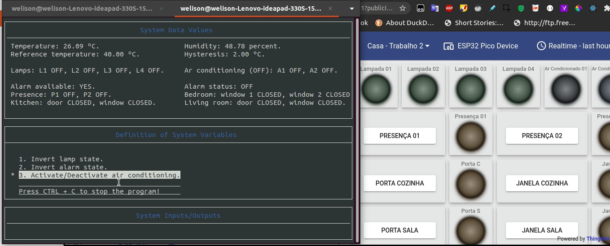

# Sistema Distribuído de Automação Residencial

**Disciplina**: Fundamentos de Sistemas Embarcados (UnB) - Professor Renato Coral. 
**Tópicos**: Automação residencial, GPIO, TCP/IP, I2C, Raspberry. 

## Sobre o Projeto 02

O trabalho tem por objetivo a criação de um **sistema distribuído de automação residencial para controle e monitoramento de sensores e dispositivos**. O sistema deve funcionar em um conjunto de placas Raspberry Pi com um servidor central responsável pelo controle e interface com o usuário e servidores distribuídos para leitura e acionamento dos dispositivos. Dentre os dispositivos envolvidos estão o monitoramento de temperatura, sensores de presença, sensores de abertura e fechamento de portas e janelas, acionamento de lâmpadas, aparelhos de ar-condicionado e alarme.

Maiores informações e requisitos do trabalho disponíveis em:
*   [Gitlab - FSE - Projeto 2](https://gitlab.com/fse_fga/projetos/projeto-2).

## Demonstração do Projeto

## Execução do Projeto

Para executar o projeto, faça o clone do repositório e, na pasta principal, proceda com as instruções:

*   Primeiro, entre na pasta `central_server` e proceda com os comandos:
    *   Compilar: `make`; e
    *   Executar: `bin/bin`.
*   Agora, em outro terminal, entre na pasta `distributed_server` e faça o mesmo:
    *   Compilar: `make`; e
    *   Executar: `bin/bin/`.

*   Logs da execução do programa são salvos em `/central_server/data/logs.csv`.

Observações:
    *   Seguir a ordem de execução citada acima;
    *   Maioria informações sobre bibliotecas, arquitetura e hardware do projeto podem ser encontradas no [link](https://gitlab.com/fse_fga/projetos/projeto-2).

## Instruções de Uso

O menu é seccionado em três grandes regiões: informações sobre o sistema; menu de opções; e entradas ou saídas do usuário ou sistema.

No menu de opções, pode-se optar pelos itens abaixo:

*   1. Inverter o estado atual de dada lâmpada.
    *   **Comando**: pressione enter e digite o número da lâmpada (1 - 4).
    *   Comentário: inverte o estado da lâmpada `i` de ON -> OFF ou OFF -> ON.
*   2. Inverter o estado do alarme.
    *   **Comando**: pressione enter.
    *   Comentário: inverte o estado do sistema de alarme de ON -> OFF ou OFF -> ON.
*   3. Ativar ou desativar os ar-condicionados.
    *   **Comando**:
        *   Caso o ar-condicionado esteja ligado, pressione enter para desligar ambos.
        *   Caso o ar-condicionado esteja desligado, pressione enter, digite a temperatura de referência e a histerese.
    *   Comentário: realiza o controle de temperatura com base na escolha do usuário, na temperatura de referência e na histerese.

*   Para encerrar o programa pressione `CTRL + C` no servidor central e no servidor distribuído.

## Autor

|Matrícula | Estudante |
| -- | -- |
| 17/0024121  |  Welison Lucas Almeida Regis |

## Referências

*   [Driver da Bosh para o sensor BME280](https://github.com/BoschSensortec/BME280_driver)
*   [Descrição do trabalho prático 02](https://gitlab.com/fse_fga/projetos/projeto-2)
